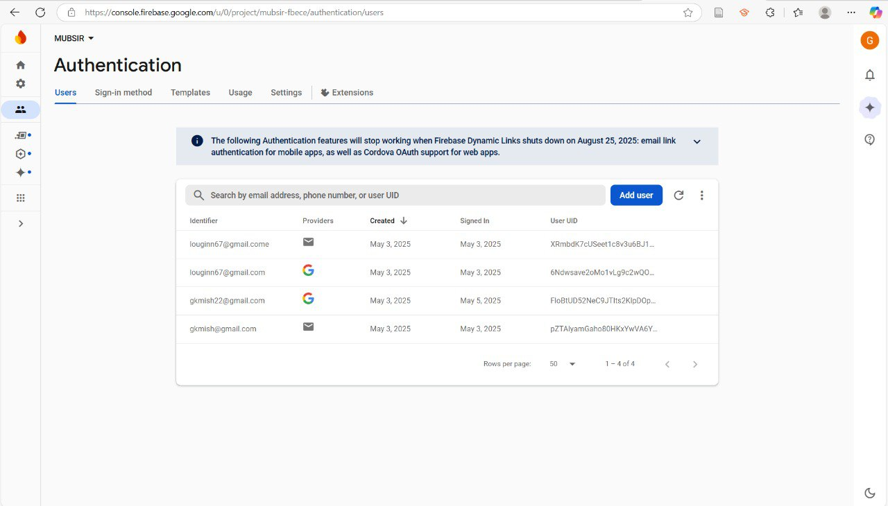

# MUBSIR – FCIT Campus Navigation Assistant

A smart, web-based navigation system for the Faculty of Computing and Information Technology (FCIT) at King Abdulaziz University. It helps students locate classrooms by interacting with a 3D model of the building based on the course they select from their weekly schedule.

---

## Project Description

**MUBSIR** is a React-based academic navigation system designed to solve the challenge students face in locating classrooms within FCIT, especially during the first few weeks of the semester.

The system allows students to:
- Navigate to a weekly schedule page
- Add courses by selecting sections
- Click on a course to instantly navigate to the 3D map page
- Highlight the corresponding classroom manually
- View course information in a sidebar
- students can move to buildings on campus for easy access to the building location.

Unlike other systems, MUBSIR does not rely on system time to highlight current classes automatically. Instead, the user decides which course to view, and the map reacts accordingly.


The 3D model of FCIT was carefully designed using **Blender** and then integrated into the React project using Ten.js and React Three Fiber.

---

## Key Features

-  Interactive 3D FCIT Map: (designed in Blender and rendered via `@react-three/fiber`)
-  Schedule-based navigation: – select a course to jump to its room
-  Manual room highlighting with lighting effects
-  Floating sidebar showing: selected course/section information
-  Firebase Authentication: supports Email/Password & Google login
-  Smooth user experience across devices (responsive layout with Bootstrap)

---

## 🛠️ Technologies Used

- React.js – To build component-based user interfaces 
- Firebase Authentication To handle user login and authentication.
- Bootstrap 5 – For responsive and modern UI design.
- Moment.js – For managing and formatting dates and times.
- REST API – To fetch dynamic course schedule data.
- JSON-based Schedule Structure – For representing and parsing schedule data.
- Web Scraping – For extracting the initial course data.
- HTML5 & CSS3 – For creating structured and styled web pages.
- JavaScript (Vanilla & React) – For implementing interactivity and dynamic behavior.
- AJAX (Fetch API) – For loading data without refreshing the page.

---
## Learning Outcomes Achieved

- ✅ CLO1: Develop well-structured, standards-compliant, accessible Web pages using HTML5
- ✅ CLO2: Develop standards-compliant CSS code to style and enhance HTML pages

- ✅ CLO3 – Styled layout using external CSS and Bootstrap
- ✅ CLO4: Build dynamic web pages using AJAX technology
- ✅ CLO5: Create JSON in JavaScript and insert data into HTML
- ✅ SO1: Design and implement a computing solution to meet user needs
- ✅ SO2: Work effectively as a member of a team


---

## Accessibility

- Semantic JSX (HTML5) structure
- `alt` tags and labels (where applicable)
- Responsive UI design

---


## 📷 Screenshots

**Home Page**

The homepage of MUBSIR features the main navigation bar with the core sections of our website. At the top of the page, students can begin by creating their personalized class schedule.

Following the homepage, our services section highlights the key features MUBSIR offers to students including personalized schedule creation, interactive campus navigation, and classroom route assistance.

Finally, the site presents key university buildings that are important for students, providing brief descriptions and direct access links to each location. At the bottom, the developers’ personal accounts are listed, allowing users to access them directly by clicking on the names.

 
 

---
**Sign Up / Sign In**

At the top right of the page, students can either join or sign in using their preferred manually or through Google. Once the account is created, the user’s data is stored and managed using Firebase.

 
 

---

---
**Schedule**

When students create their academic schedule, they search for course names and available sections, then add them to the timetable. Once completed, this schedule enables them to view their personalized classroom directions on the campus map.


---
**Map**

When a class is about to start, the classroom marker on the map automatically lights up (with a glowing or pulsing effect) to clearly indicate its location, helping students find their classroom effortlessly.


---

## Folder Structure (Simplified)

```
src/
├── components/
│   ├── CampusMapViewer.js
│   ├── Navbar.js
│   └── ContactUs.js
├── pages/
│   ├── CampusAccess.js 
│   ├── firebase.js
│   ├── Home.js
│   ├── Login.js
│   ├── Map.js
│   ├── Schedule.js
│   ├── services.js
│   └── Signup.js
├── styles.css
├── App.js
└── index.js
```

---

##  How to Run Locally

1. Clone the repository:
   git clone https://github.com/lojainAlghamdi/mubsir-react.git
   cd mubsir-react

2. Install dependencies:
  npm install

3. Start the development server:
 npm start

---


## Live Demo

> [🚀 GitHub Pages Live Demo](https://github.com/lojainAlghamdi/mubsir-react.git)

---
## Team Members & Roles

| Name               | ID       | Role                                      |
|--------------------|----------|-------------------------------------------|
| Lojain Alghamdi    | 2207786  | Backend Developer – API & logic           |
| Rafal Fakeera      | 2206421  | 3D Model Designer – Blender + integration |
| Marya Alkanani     | 2129219  | Frontend Developer – UI/UX + React        |
| Ghada Allaythi     | 2207251  | Data Engineer – Web scraping & AJAX       |

> *Team members collaborated across testing, integration, and final design stages.*

---

## About the Project  

This project was developed as a course requirement for **CPIT 405 – Internet Applications** at **King Abdulaziz University** under the supervision of **Dr. Rania AlHazmi**.

---

## Contact with developers in X:

[@_ghadaa112](https://x.com/_ghadaa112) • [@itzrafal_](https://x.com/itzrafal_) • [@xflojain](https://x.com/xflojain) • [@marya_fawaz](https://x.com/marya_fawaz)
